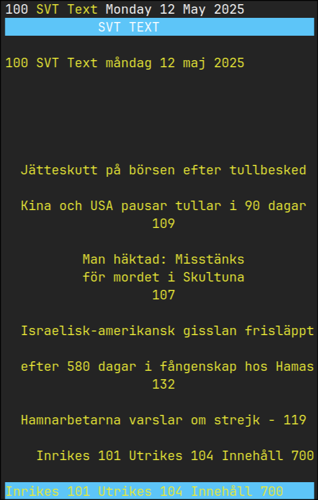

# Text TV Viewer

A C# console application for displaying Text TV pages from the texttv.nu API with proper styling and formatting.

> **Note**: This project was vibe coded with Windsurf and Sonnet 3.7, including these docs.

## Screenshot



[Recording](media/recording.mp4)

*Screenshot of the Text TV viewer displaying page 100, showing headlines in yellow, secondary content in cyan, and a blue navigation bar at the bottom.*

## Project Overview

This application fetches Text TV content from the texttv.nu API and renders it in the console with appropriate styling:
- Yellow headlines
- Cyan secondary text
- White regular text
- Blue navigation bar at the bottom

## Project Structure

The solution follows a clean architecture with separation of concerns:

```
TextTv.sln
├── TextTv.Cli (Main console application)
│   ├── Models/
│   │   └── TextTvPage.cs (Data model for API responses)
│   ├── Services/
│   │   └── TextTvService.cs (API interaction)
│   ├── Rendering/
│   │   └── TextTvRenderer.cs (Console output formatting)
│   └── Helpers/
│       ├── TextParsingHelper.cs (HTML parsing utilities)
│       └── Utils.cs (General utility methods)
└── TextTv.Cli.Tests (Unit tests)
    ├── HttpClientMock.cs (HTTP client mocking)
    ├── TextParsingHelperTests.cs
    ├── TextTvServiceTests.cs
    └── UtilsTests.cs
```

## Key Design Decisions

1. **Separation of Concerns**: 
   - The code is organized into logical areas (Models, Services, Rendering, Helpers) to improve maintainability and readability.
   - Each class has a clear single responsibility.

2. **Clean API Interaction**:
   - Abstracted API calls through the `TextTvService` class.
   - Well-defined model with `TextTvPage` record.

3. **HTML Parsing and Rendering**:
   - Using HtmlAgilityPack for robust HTML parsing.
   - The `TextParsingHelper` handles all HTML parsing logic.
   - `TextTvRenderer` manages console output with proper styling.

4. **Error Handling**:
   - Robust error handling for API requests, JSON parsing, and rendering.
   - Graceful fallbacks when parsing fails.

5. **Testing**:
   - Comprehensive unit tests for all components.
   - Mock HTTP client for testing API interactions without actual network calls.

## Dependencies

- .NET 9.0
- HtmlAgilityPack 1.12.1 (for HTML parsing)
- Moq 4.20.72 (for testing)
- MSTest framework

## Building the Application

To build the application:

```bash
cd src/
dotnet build
```

## Running the Application

To run the application and view a Text TV page (e.g., page 100):

```bash
cd src/texttv-csharp/TextTv.Cli
dotnet run -- 100
```

Replace `100` with any valid Text TV page number.

## Publishing as a Single Executable

To publish the application as a self-contained, single-file executable for Linux:

```bash
dotnet publish src/TextTv.Cli/TextTv.Cli.csproj -c Release -r linux-x64 -p:PublishSingleFile=true -p:AssemblyName=texttv --self-contained -o publish
```

This creates a self-contained executable in the `publish` folder that can run on any compatible Linux system without requiring .NET to be installed.

To run the published application:

```bash
cd publish
./TextTv.Cli 100
```

## Running Tests

To run the unit tests:

```bash
cd src/TextTv.Cli.Tests
dotnet test
```

## API Usage

The application uses the texttv.nu API with the following format:
```
https://texttv.nu/api/get/{pageNumber}?includePlainTextContent=1
```

This returns a JSON array containing page content and navigation information.
