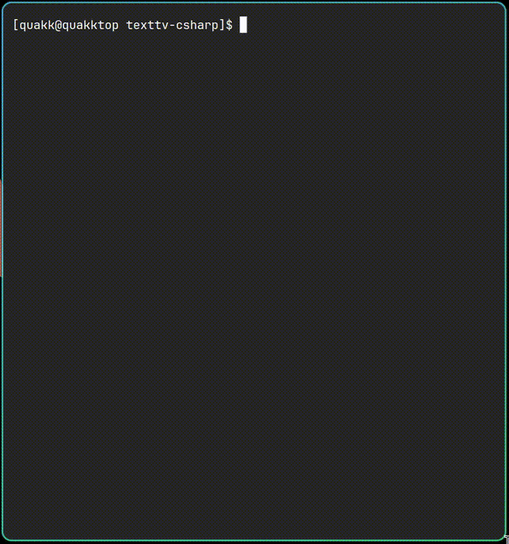
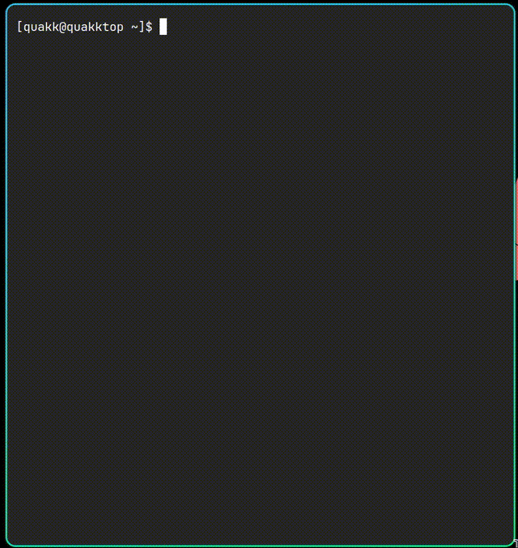

# TextTV Viewer

A C# console application for displaying Text TV pages from the texttv.nu API with proper styling and formatting. Now supports converting web pages to TextTV format using OpenAI's GPT-4.1.

> **Note**: This project, including this readme, was vibe coded with Windsurf / Sonnet 3.7 and GitHub Copilot Agent / GPT 4.1. 

## Demo TextTV Mode



*Recording of the TextTV viewer navigating pages.*

## Demo URL Mode



*Recording of the TextTV viewer navigating to a url.*

## Project Overview

This application offers two main modes of operation:

1. **TextTV Mode**: Fetches TextTV content from the texttv.nu API
2. **URL Mode**: Converts web page content to TextTV format using OpenAI's GPT-4.1

Both modes render the content with the classic TextTV styling:
- Yellow headlines
- Cyan secondary text
- White regular text
- Blue navigation bar at the bottom

## Project Structure

The solution follows a clean architecture with separation of concerns:

```
TextTv.sln
├── TextTv.Cli (Main console application)
│   ├── Configuration/
│   │   ├── CommandLineOptions.cs (Command-line argument handling)
│   │   ├── PromptConstants.cs (OpenAI prompts for URL mode)
│   │   ├── Settings.cs (Application settings model)
│   │   └── SettingsProvider.cs (Settings file handling)
│   ├── Models/
│   │   └── TextTvPage.cs (Data model for API responses)
│   ├── Services/
│   │   ├── TextTvService.cs (TextTV API interaction)
│   │   ├── OpenAi/
│   │   │   └── OpenAiService.cs (OpenAI API integration)
│   │   └── Web/
│   │       └── WebContentService.cs (Web content fetching)
│   ├── Rendering/
│   │   └── TextTvRenderer.cs (Console output formatting)
│   └── Helpers/
│       ├── TextParsingHelper.cs (HTML parsing utilities)
│       └── Utils.cs (General utility methods)
└── TextTv.Cli.Tests (Unit tests)
    ├── HttpClientMock.cs (HTTP client mocking)
    ├── TextParsingHelperTests.cs
    ├── TextTvServiceTests.cs
    └── UtilsTests.cs
```

## Key Design Decisions

1. **Separation of Concerns**: 
   - The code is organized into logical areas (Models, Services, Rendering, Helpers, Configuration) to improve maintainability and readability.
   - Each class has a clear single responsibility.

2. **Multi-Mode Operation**:
   - TextTV Mode: Original functionality to fetch content from the texttv.nu API.
   - URL Mode: New functionality to convert web content to TextTV format using OpenAI.
   - Consistent rendering interface for both modes.

3. **Clean API Interaction**:
   - Abstracted API calls through dedicated service classes.
   - Well-defined model with `TextTvPage` record shared across modes.
   - Consistent error handling for both API types.

4. **HTML Parsing and Rendering**:
   - Using HtmlAgilityPack for robust HTML parsing.
   - The `TextParsingHelper` handles all HTML parsing logic.
   - Mode-aware `TextTvRenderer` for different UI presentations.

5. **AI Integration**:
   - Carefully designed prompts for optimal TextTV format conversion.
   - Few-shot learning examples to ensure high-quality output.
   - Content limitations to fit TextTV screen dimensions.

6. **Error Handling**:
   - Robust error handling for API requests, JSON parsing, and rendering.
   - Graceful fallbacks when parsing fails.

7. **Testing**:
   - Comprehensive unit tests for all components.
   - Mock HTTP client for testing API interactions without actual network calls.

## Dependencies

- .NET 9.0
- HtmlAgilityPack (for HTML parsing)
- OpenAI (official .NET SDK for OpenAI integration)
- Microsoft.Extensions.Configuration.Json (for settings handling)
- Moq (for testing)
- MSTest framework

## Building the Application

To build the application:

```bash
cd src/
dotnet build
```

## Running the Application

### Auto-Detection Mode (New!)

The application can now automatically detect if the input is a URL or a page number:

```bash
cd src/texttv-csharp/TextTv.Cli
# For page numbers
dotnet run -- 100

# For URLs
dotnet run -- https://example.com
```

This simplifies usage by automatically determining the appropriate mode based on your input.

### TextTV Mode

You can still explicitly specify TextTV mode using the `--pagenumber` flag:

```bash
dotnet run -- --pagenumber 100
```

Replace `100` with any valid Text TV page number.

### URL Mode

Similarly, you can explicitly use URL mode with the `--url` flag:

```bash
dotnet run -- --url https://example.com
```

Replace `https://example.com` with any valid URL you want to convert to TextTV format.

### Setting Up OpenAI API Key

To use the URL mode, you need to configure your OpenAI API key:

1. Make sure you have an OpenAI API key. If you don't have one, you can create it in your [OpenAI dashboard](https://platform.openai.com/api-keys).

2. Create an `appsettings.json` file in the `TextTv.Cli` directory with the following content:

```json
{
  "OpenAiApiKey": "your-api-key-here",
  "OpenAiModel": "gpt-4.1"
}
```

3. Replace `your-api-key-here` with your actual OpenAI API key.

**Note**: The `appsettings.json` file is excluded from git via `.gitignore` to prevent accidental exposure of your API key.

## Publishing as a Single Executable

To publish the application as a self-contained, single-file executable for Linux:

```bash
dotnet publish src/TextTv.Cli/TextTv.Cli.csproj -c Release -r linux-x64 -p:PublishSingleFile=true -p:AssemblyName=texttv --self-contained -o publish
```

This creates a self-contained executable in the `publish` folder that can run on any compatible Linux system without requiring .NET to be installed.

To run the published application:

```bash
cd publish
./TextTv.Cli 100
```

## Running Tests

To run the unit tests:

```bash
cd src/TextTv.Cli.Tests
dotnet test
```

## API Usage

The application uses the texttv.nu API with the following format:
```
https://texttv.nu/api/get/{pageNumber}?includePlainTextContent=1
```

This returns a JSON array containing page content and navigation information.
